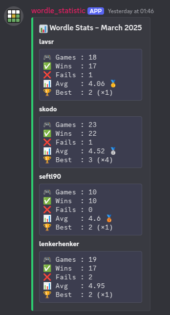

# inDiaHunter Discord Bot

combines several functions:

- reads shared wordle data from specified channel and returns statistics about it.
Post the monthly statistic to a channel once each new month
Reacts to the command `wordle_stats <month> <year> <users>` to provide statistic

- keeps tracks of reminder and notifies users when they are due `/reminder`

## Deployment

Deployed natively (no Docker) as a systemd service by
[`nixos-setup`](https://github.com/MyNameIs-13/nixos-setup)'s
`modules/indiahunter-discord-bot` Module, which builds this repository's
`app/` directory with `buildPythonApplication` and pulls it in as a flake
input. `nixos-setup.indiahunterDiscordBot.enable = true` on the Bifrost
Profile is the one place it's turned on.

## Environment variables

- `DISCORD_TOKEN` - required - token from your discord bot
- `CHANNEL_ID` - required - id from your discord channel where wordle data is shared
- `SERVER_ID` - optional - id from your discord server (makes the command available faster)
- `LOG_LEVEL` - optional - `{INFO, WARNING, ERROR, CRITICAL}` (everything else defaults to `DEBUG`); logs always go to stdout
